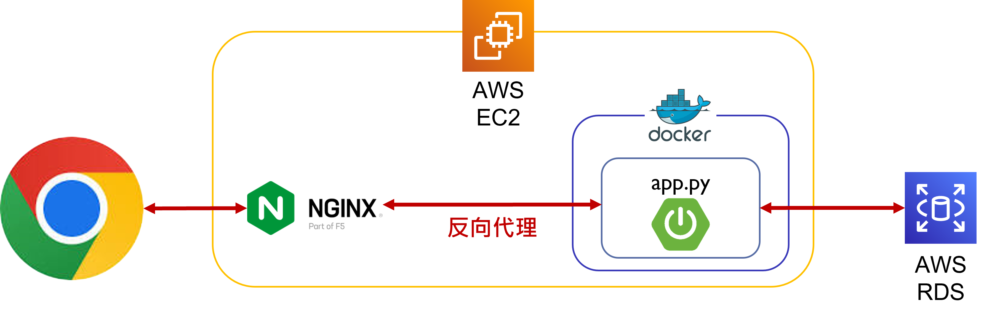

# spring boot Project project hub

## 網址
https://springbootpractice.yin888.info/

## 簡介
個人專案展示網站，以 Java 的 Spring boot 作為網站的後端框架搭配 Spring Security 作為會員登入驗證的工具及 MySQL 儲存會員資料；前端的版面使用 Bootstrap 完成。
 
登入帳號：123@123
登入密碼：123

## 網頁架構

## 使用工具
*   AWS
    *   EC2
     可擴展的運算容量，部署網頁應用程式。
    *   RDS
     雲端關聯式資料庫，此專案使用其中 MySQL 資料庫。
*   Java
    *   Spring Boot
     開發網頁應用框架，內嵌 Web server Tomcat 。
    *   Maven
     軟體專案管理及自動構建工具，基於專案物件模型（Project Object Model, POM）概念， Maven 利用一個中央資訊片斷能管理一個專案的構建、報告和文件等步驟。
    *   Tomcat
     基於 Java 應用程序設計的Java Servlet 容器，輕量級Web應用伺服器。
    *   Thymeleaf
     XML/HTML5 模板引擎，自然模版（Natural template），模版頁面本身是只需瀏覽器就可檢視的 HTML 檔， Spring MVC 中的V（View）。
    *   MySQL Driver
     使用資資料庫 MySQL。
    *   JDBC
     Java Database Connectivity，Java資料庫連線，執行SQL語句的java API。
    *   Hibernate
     Java的object-relational mapping（ORM），將 Java 中的物件與物件關係映射至關聯式資料庫中的表格與表格之間的關係。
    *   JPA
     Java Persistence API ，透過標準規範及接口（API）實現ORM（object-relational mapping）框架，通過註解（annotation）或XML描述物件－關係表的對映關係，並將執行期的實體物件持久化到資料庫中。
    *   Spring boot Devtools
     修改檔案後自動重啟部署。
    *   Spring Security
     Spring boot的安全框架，它的函式庫提供驗證（authentication）與授權（authorization）等有關安全管理的功能。
*   JavaScript
    *   Bootstrap
     網頁物件布置及設定
*   Others
    *   Docker
     輕量級的虛擬化技術，跨平台部屬專案。
    *   nginx
     網頁伺服器，此專案應用其反向代理 ( Reverse Proxy ) 的功能。
    *   git
     版本控管工具。

## 問題解決
### 發生問題：無法使用特定 Spring Security 套件
### 尋找真因：
*   繼承 WebSecurityConfigurerAdapter 套件會報錯，於 2022 年 2 月不再支援此套件（Spring Security 5.7.1 以上或是 Spring Boot 2.7.0 以上）
### 解決方案：
-   Spring 鼓勵以基於元件的安全設置， SecurityFilterChain 方法配置 HTTP 安全性並設定各網頁的授權規則、登入表單客製化及登出方法等安全性設置。
